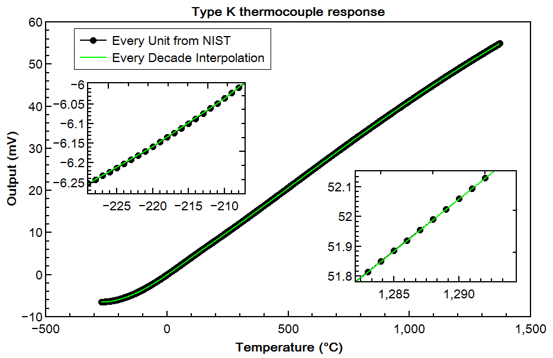

# thermocouples
Python library of random things dealing with thremocouples.

##Type K
Type K thermocouples are pretty linear on a small scale. For any 10 degree C range, the slope can be described very well with a linear function. The file `typek.py` uses the values from NIST at every 10 degrees, and uses linear interpolation to calculate the values in between. This results in a very fast, small library to calculate the temperature from a type K thermocouple. 

```python
import typek
temp_C = typek.get_temp(cold_junction_temp_C, thermocouple_millivolts)
```

Compared to the full set of values from NIST (included as `nist_typek.py`), the interpolation works very well:



And the error is well below what most ADC's can measure, and is therefore negligible. For example, my 16-bit ADC with a range of ±0.256 volts measures 0.0078 millivolts per bit (theoretical measurement increment), plus some instrumental error.


